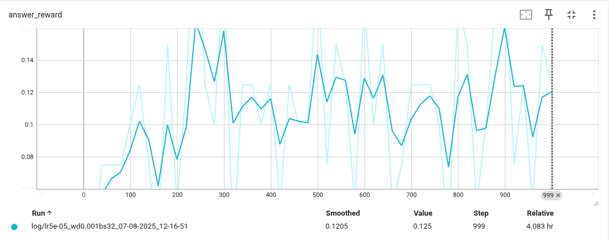
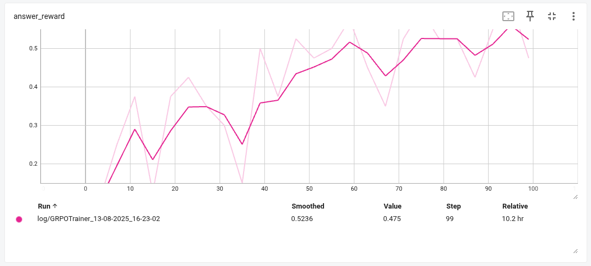
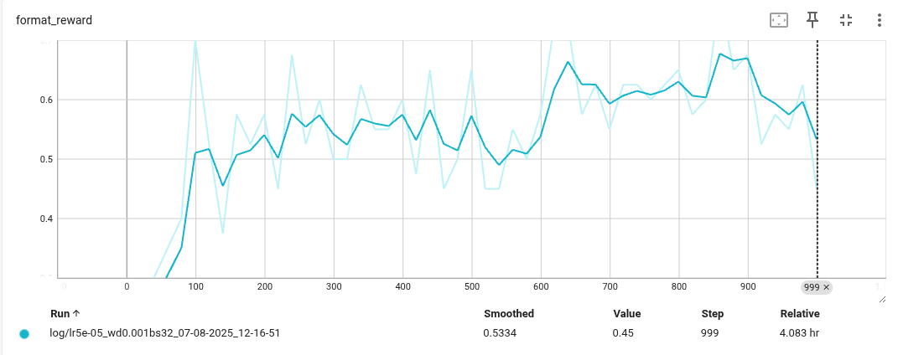
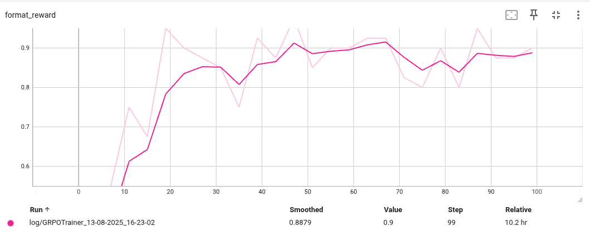

# Efficient Tune
This repository implement several parameter efficient fine tuneing methods that can train a **1.5B model** with a single **8GB** GPU.

The focus is on single-node trainers, written in a clear and concise way for educational purposes, so you can better understand how the training process works under the hood

For simplicity, all examples use the Qwen/Qwen2.5-Math-1.5B model.

## Implemented Trainers
+ **Supervise Fine Tuning (SFT)** - Fine-tune a model using human-written chain-of-thought labels - see [`grpo_trainer.py`](efficient_tune/trainer/grpo_trainer.py)
+ **Group Relative Policy Optimization (GRPO)** - Optimize directly for answer correctness via reinforcement learning. - see [`grpo_trainer.py`](efficient_tune/trainer/sft_trainer.py)

## Prerequisites
- Python 3.12
- NVIDIA GPU with at least 8 GB VRAM (All experiments were run on an RTX 3070 Ti)

## Quick Start

### Installation and Testing
```sh
# Clone this repository
git clone https://github.com/tfzzzh/efficient-tune.git
cd efficient-tune

# Install uv package manager**
pip install uv

# Install dependencies
uv sync

# Run tests to verify installation
uv run pytest
```

### Fine-tuning
```shell
# fine tune LLM via GRPO
uv run python scripts/run.py --trainer grpo

# train LLM via SFT
# uv run python scripts/run.py --trainer sft
```

### Monitor Training Process
Launch TensorBoard to visualize training metrics in real-time:
```sh
uv run tensorboard --logdir data/outputs/log/
```
Then navigate to http://localhost:6006 in your browser to training/evaluation metrics.


## Experiment Results
### Evaluate Reward on Answer Correctness
Measures the ratio of correct answers compared to ground truth.

***SFT***

***GRPO***


### Evaluate Reward on Format Following
Measures the ratio of generated text following the ***r1-format***:
```
<think> think_process_of_the_model <think> 
<answer> answer_of_the_problem <answer>
```

***SFT***

***GRPO***


## References and Acknowledge
- [Stanford CS336: Language Modeling from Scratch](https://stanford-cs336.github.io/spring2025/)
- [QWen2.5](https://arxiv.org/abs/2412.15115)
- [Deepseek GRPO](https://arxiv.org/pdf/2501.12948)